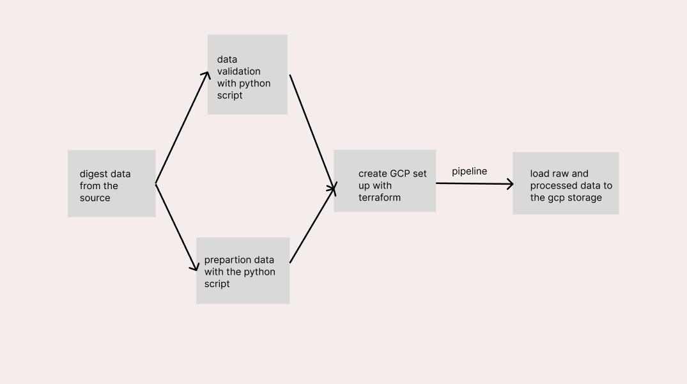

# junior_dataEngineer_task
the first project of junior_dataEngineer to polish skills 

#to set the environment with the docker
#i just test with the localhost with docker compose
docker compose up -d 

#to set up the gcp with terraform
terraform init
terraform plan
terraform apply

#sample dataset 
#i used the openai text dataset that is destined for to mathematics Q&A
from datasets import load_dataset

ds = load_dataset("openai/gsm8k", "main")

#pipeline architecture

#Deployment instruction
1.First at all look for what the dataset that we want to process
2.Digest the dataset with digesting_dataset.py from huggingface
#to run the script
python pipeline.py --dataset_name=openai/gsm8k --split=train --subset=main --user=root --password=root --host=localhost --port=5432 --db=gsm8k --table_name=gsm8k_train
3.Data clean and build the table schema for the preprocessed data with text_preprocessor.py and data_validation.py
4.Create GCP set up with terraform
5.Run the main.py to load the processed data to GCP storage and SQL
6.Create Environment and credentials with docker file and docker compose yml
#to run docker 
docker compose up -d

